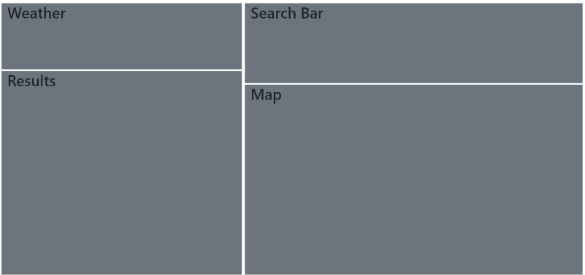

# Where2P

## About
We created this app based on the lack of resources available for those who need to use a bathroom in a public setting on the go. Where2P provides a list of possible restrooms which are pulled from both the Yelp and Google Places API calls using AJAX. The list is based on the current location of the user obtained from the Google Maps API. The user is able to view the suggested locations by Yelp marked by blue markers and Google locations marked by red markers. The user's current location is marked by a purple marker. 

 Implementing Geocoding API, we've included the feature of searching for a new location if the user decides to search for restrooms in a different area via street address. The results for both Yelp and Google will also update to display nearby restroom locations to that street address. 

 The user will also be able to leave a review that will be stored in Firebase. If they visit a bathroom location listed from either Yelp or Google Places, they will have an option to "Add Review". The user will be able to submit their name and review. After clicking submit, their input and associated data-id will be stored in Firebase. Users will be able to see other reviews written by other users.

To make the app more beneficial to the user, we've included a widget from the  OpenWeatherMap API that lets the user know what the weather is based on their current location. 

## Wireframe

######
| Technology Used | Reference |
| --------------- | --------- |
| HTML | https://developer.mozilla.org/en-US/docs/Web/HTML |
| CSS | https://developer.mozilla.org/en-US/docs/Web/CSS |
| Materialize | https://materializecss.com/ |
| JavaScript | https://www.javascript.com/ |
| jQuery | https://jquery.com/ |
| Firebase | https://firebase.google.com/ |
######

######
| API Used | Reference |
| --------------- | --------- |
| OpenWeatherMap | https://openweathermap.org/ |
| Yelp | https://www.yelp.com/developers/documentation/v3 |
| Google Maps | https://developers.google.com/maps/ |
| Google Places | https://cloud.google.com/maps-platform/places/ |
| Geocode | https://developers.google.com/maps/documentation/geocoding/start|
######

#####  
Authors  | Github
------------- | -------------
Jake Dudum  | https://github.com/JakeDudum
Darryl Tolentino  | https://github.com/DarrylJLTolentino
Hallie Calhoun | https://github.com/halliecalhoun
Adrienne Liu  | https://github.com/adrienneliu